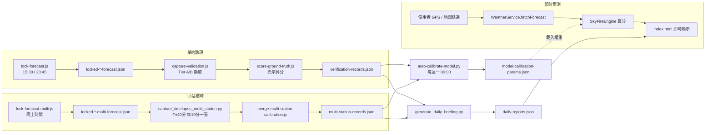

# SkyFire GPS — 系統運作說明

> 這份文件描述「現在」（2026-09-11）網站實際怎麼運作：預測引擎、驗證管線、
> 排程觸發、資料流。偏功能行銷的說明在 `README.md`；單次交接筆記在
> `HANDOFF.md`（gitignored，不進版控）。這份文件進版控，架構變動時應同步更新。

Live 站：https://ymeroom.github.io/skyfire-gps/（GitHub Pages，`main` 分支直接發布，無 build step）

---

## 1. 三個彼此獨立的子系統

| 子系統 | 進入點 | 有沒有「鎖定預測 → 事後驗證」 |
|---|---|---|
| **GPS 即時預測**（產品核心） | `js/app.js` → `WeatherService.fetchForecast()` | 沒有，純即時算分，使用者當下看到什麼就是什麼 |
| **單站官方驗證**（象山／大稻埕 2 個 4K 直播） | `lock-forecast.js` → `capture-validation.js` → `score-ground-truth.js` | 有，寫入 `data/verification-records.json` |
| **13 站縮時驗證**（全台攝影聖地） | `lock-forecast-multi.js` → `capture_timelapse_multi_station.py` → `merge-multi-station-calibration.js` | 有，寫入 `data/multi-station-records.json` |

三者共用同一套預測引擎（`skyfire-engine.js` + `weather-service.js`），但資料互不流通、互不阻擋——任一條線掛掉不影響另外兩條。

---

## 2. GPS 即時預測

1. `js/app.js` 用 `navigator.geolocation` 或地圖點選取得經緯度，`geocoding.js` 逆地理編碼成地名。
2. `weather-service.js` 打 Open-Meteo，同時算出**太陽方位角上游 60km 取樣點**（`calculateUpstreamCoords`）一併查詢——這是「地平線透光窗」判斷雲層是否擋住入射光路的關鍵，不是只看當地雲量。
3. `skyfire-engine.js` 用分層光路模型算分（0-100）：
   - 高雲 (6000m+ 卷雲)：+45 分封頂，強化長波散射
   - 中雲 (2000-6000m 立體積雲)：+20 分封頂
   - 低雲：懲罰，斜率 `lowCloudSlope` 可被自動校準調整
   - 地平線透光窗、能見度、濕度：微調項
   - 權重存在 `SkyFireEngine.activeWeights`，會被 `model-calibration-params.json`（見第 6 節）覆寫
4. 15 分鐘記憶體快取（`CACHE_DURATION_MS`），`forceRefresh: true` 可繞過（鎖定腳本一律用這個，見第 3 節的歷史 bug）。
5. 這條路徑**沒有**鎖定/驗證，使用者看到的分數就是查詢當下的最新結果。

## 3. 預測鎖定 (Lock Forecast)

避免「用未來已知的天氣回頭生成看起來很準的預測」，兩支腳本在**當地實際看到天空之前**把預測分數寫死存檔：

| 腳本 | 鎖定對象 | 觸發時間（台北） | 輸出 |
|---|---|---|---|
| `lock-forecast.js` | 象山 + 大稻埕 2 個官方站 | 日落 15:30 / 日出 23:45（隔日） | `locked-sunset-forecast.json` / `locked-sunrise-forecast.json` |
| `lock-forecast-multi.js` | `spots-taiwan.js` 中屬於本時段的 6-8 個聖地 | 同上（同一次觸發） | `locked-sunset-multi-forecast.json` / `locked-sunrise-multi-forecast.json` |

兩支互相獨立、一個失敗不連坐另一個。時段判斷靠 `MANUAL_SESSION` 環境變數（手動觸發時）或呼叫端直接指定，不再依賴解析 cron 字串。

## 4. Ground Truth 擷取 — 單站 (Tier A/B)

`capture-validation.js` 在出景窗口對官方直播做 **yt-dlp DVR 精確回溯**擷取一張影格（Tier A）；抓不到（bot-check、DVR 過期）就降級抓 YouTube 縮圖海報格（Tier B，`fidelity: "poster"`）；再抓不到就誠實記 `capture_unavailable`，**不編造資料**。

`score-ground-truth.js` 讀影格做 **CIELAB/HSV 色彩直方圖分析**，算出光學實測分數，跟同一天鎖定的 `locked-*-forecast.json` 配對，寫 `verification-records.json`（欄位含 `prediction`/`verification`/`errorAbsolute`/`verdict`，判定門檻見第 7 節）。

## 5. Ground Truth 擷取 — 13 站縮時

`capture_timelapse_multi_station.py` 是重頭戲：對 7-8 個 YouTube 直播機位，在事件前後 `T-40` 到 `T+40` 分鐘、每 10 分鐘擷取一張（共 9 張/站），全部走 yt-dlp DVR 回溯（無 Tier B 降級）。

- **暗夜閘門 (Night Gate)**：入夜後的暖色像素會被誤判成火燒雲，所以窗口外的影格一律封頂在 12 分。
- **Canonical Ground Truth**：同一站 9 張影格中，取「暮光窗口內、未被暗夜閘門封頂」的最高分作代表值。
- **DVR 限制是不對稱的**：不同直播保留的可回溯時長差很多（多數 ~4 小時，個別站點觀察到只有 ~75 分鐘甚至 ~25 秒），抓不到就誠實記錄失敗原因（`canonical.reason`，例：「直播 DVR 視窗過短」），不假造分數。金龍山已因 DVR 只剩 ~25 秒且無替代直播被移出擷取清單（仍留在 `spots-taiwan.js` 當可造訪景點）。
- **睡到擷取窗**：腳本進場後若擷取窗口 (`T+45分`) 還在未來，會 sleep 到那個時刻再擷取（上限 4 小時）——這是為了在 GitHub 排程仍會偶爾延遲、或本機任務提早觸發時，讓實際擷取時刻仍落在暮光內。

`merge-multi-station-calibration.js` 把縮時輸出跟 `lock-forecast-multi.js` 鎖定的預測配對，寫入 `multi-station-records.json`。合併採**證據較強者優先**（有 ground truth > 沒有；`peakRegionUngatedOk` 較多者優先；平手保留舊紀錄避免時間戳無謂變動），所以較晚一次失敗的補跑不會洗掉較早一次的成功結果，push 衝突時可以放心 `git reset --hard origin/main` 後重新跑一次合併。

## 6. 每週模型自我校準

`auto-calibrate-model.py`（週一 00:00 觸發）讀 `verification-records.json` + `multi-station-records.json`，對 `skyfire-engine.js` 的權重做網格搜尋，找出讓「預測 vs 光學實測」誤差最小的參數組合，寫回 `model-calibration-params.json`（前端載入時會覆寫 `activeWeights`）。

門檻與防呆：
- `MIN_SAMPLES_FOR_CALIBRATION`（目前 15）+ `MIN_DISTINCT_DAYS`（5，13 站同日共用綜觀天氣不算獨立樣本）
- `is_reliable_record()` 排除：Tier B 降級影格、`verification.reliable === false` 的紀錄、雨天光學畫面（看實際降雨狀態，不是 gate 是否觸發）
- **高分縮時樣本 containment**：`provenance === 'multi-station-timelapse'` 且 `groundTruthScore > MULTI_STATION_GT_CEILING`（60）的紀錄只記錄、不參與校準——因為光學評分器在高分區間還沒有足夠人工驗證，怕網格搜尋把權重帶偏
- `MIN_IMPROVEMENT_ABS/REL` 顯著性門檻：改善不夠大就不覆寫，並寫 `lastReviewedAt`/`lastReviewOutcome` 審查軌跡

## 7. 每日報告產生

`generate_daily_briefing.py` 是資料驅動的報告產生器（**不是**寫死內容——2026-09-08 之前的版本是，那是那次修的核心 bug）：

- 讀取當天所有站點紀錄，用 `_reliable()` 過濾掉不可靠的（`verification.reliable === false`、`groundTruthScore == null`、或 `prediction.isSimulated`，後者是 Open-Meteo 掛掉時的模擬預測站不算數）
- 標頭預測值取「可靠紀錄裡最接近平均分的那一站」的鎖定值，不是重新算一次
- `verificationStatus`：`verified`（≥2 個可靠站有評分）／`insufficient`（<2 個）／`unavailable`（0 個擷取成功）——後兩者前端顯示灰色「從缺」banner，不宣稱假結果
- 驗證判定門檻（`score-ground-truth.js` 與這裡對齊）：

  | `errorAbsolute` | 判定 | 徽章 |
  |---|---|---|
  | ≤ 8 | EXACT_MATCH | 🎯 精準命中 |
  | ≤ 18 | SLIGHT_DEVIATION | ⚡ 輕微偏差 |
  | 更大 | MISMATCH | ⚠️ 需校準 |
  | null / 樣本不足 | — | ❔ 從缺 |

- 輸出 `daily-reports.json`，`js/app.js` 讀取渲染成首頁的報告卡片與歷史歸檔列表。

## 8. 排程與觸發（2026-09-11 起：本機觸發）

**背景**：GitHub Actions 的 `schedule:` 事件本身常有 1-4 小時相關性延遲（跟用不用自架 runner 無關），YouTube 直播 DVR 只保留幾小時，排程真的觸發時擷取窗早就流失——這是這個專案絕大多數資料品質問題的根源。

**現況**：4 個原本排程觸發的 workflow，`schedule:` 區塊已全部移除，只留 `workflow_dispatch` 供 GitHub Actions 頁面手動測試/補跑。實際排程改由**這台開發機器的 Windows 工作排程器**觸發：

| Windows 工作排程任務 | 觸發時間（台北） | 對應腳本 |
|---|---|---|
| `SkyFireGPS-Lock-Sunset` | 15:30 | `lock-forecast.js` + `lock-forecast-multi.js` |
| `SkyFireGPS-Lock-Sunrise` | 23:45 | 同上 |
| `SkyFireGPS-Timelapse-Sunrise` | 03:05 | `capture_timelapse_multi_station.py sunrise` |
| `SkyFireGPS-Timelapse-Sunset` | 15:40 | `capture_timelapse_multi_station.py sunset` |
| `SkyFireGPS-Validate-Sunrise` | 05:30, 09:00 | `capture-validation.js` + `score-ground-truth.js sunrise` |
| `SkyFireGPS-Validate-Sunset` | 18:45, 21:00 | 同上 sunset |
| `SkyFireGPS-WeeklyCalibration` | 週一 00:00 | `auto-calibrate-model.py` |

實作細節：
- 統一入口 `scripts/local-trigger/run-job.sh`，用 job 名稱分派到對應腳本組合 + commit + push
- **跑在獨立的機器人 clone**（`%USERPROFILE%\skyfire-gps-bot`），不是這個開發目錄——因為腳本每次起跑都 `git reset --hard origin/main` 保持乾淨狀態（比照 GitHub Actions 每次全新 checkout），在開發目錄跑會把未 commit 的工作噴掉
- 每個工作排程任務都設定 **Wake to run**（電腦睡眠中會被喚醒；喚不醒完全關機）+ **Start when available**（真的錯過的話下次開機/登入補跑一次）
- 一次性設定：`scripts/local-trigger/setup-tasks.ps1`；移除：`uninstall-tasks.ps1`；細節見 `scripts/local-trigger/README.md`
- log 在機器人 clone 底下的 `logs/local-trigger/*.log`（不進版控）；要看「今天到底有沒有跑」查這裡，**不是** GitHub Actions 執行紀錄（那邊現在只會顯示手動觸發）

副作用：住宅 IP 觸發時可以直接過 YouTube 的 bot-check，不再需要設定 `CAPTURE_RUNNER` repo variable 指向自架 runner。

## 9. 資料檔案總覽

| 檔案 | 誰寫入 | 內容 |
|---|---|---|
| `data/locked-{sunrise,sunset}-forecast.json` | `lock-forecast.js` | 單站鎖定預測 |
| `data/locked-{sunrise,sunset}-multi-forecast.json` | `lock-forecast-multi.js` | 多站鎖定預測 |
| `data/verification-records.json` | `score-ground-truth.js` | 單站預測 vs 實測配對紀錄 |
| `data/multi-station-records.json` | `merge-multi-station-calibration.js` | 13 站預測 vs 實測配對紀錄 |
| `data/daily-reports.json` | `generate_daily_briefing.py` | 前端顯示用的每日報告（聚合以上兩者） |
| `data/model-calibration-params.json` | `auto-calibrate-model.py` | `SkyFireEngine.activeWeights` 覆寫值 |
| `data/snapshots/` | 擷取腳本 | Canonical 影格（進版控，供日報顯示縮圖） |
| `data/timelapse/` | `capture_timelapse_multi_station.py` | 原始 9 張/站影格 + report.html（`.gitignore`，僅本機/runner 保留） |

## 10. 測試與部署

- `node tests/run-all-tests.js`：7 大核心模組（WeatherService 分層光路、攝影聖地資料庫、DOM ID 綁定、台灣範圍等）+ DOM 綁定 + 台灣範圍，純資料/邏輯測試，不打真實 API。
- 純靜態網站，無 build step；`main` 分支 push 後 GitHub Pages 直接發布到 https://ymeroom.github.io/skyfire-gps/。
- `sw.js` + `manifest.json`：PWA 離線快取與加入主畫面支援。

## 11. 已知限制

- **暗夜閘門**會讓延遲擷取的影格全部封頂在 12 分，即使真的補跑到也可能是沒用的資料。
- **DVR 回溯窗口長度因站而異**且不可靠（HEAD 200 不代表 GET 能抓到），已擷取失敗的站點會誠實記錄原因而非造假分數。
- **本機觸發喚不醒完全關機**的電腦（只能喚醒睡眠），且無法喚醒 BIOS 排程開機；完全關機時的排程會被跳過，等下次開機才補跑一次，屆時擷取窗可能已過。
- **高分區間的光學評分器準確度尚未人工驗證**，`auto-calibrate-model.py` 對縮時管線的高分樣本設了 ceiling containment（見第 6 節），人工驗證後才會考慮鬆綁。
